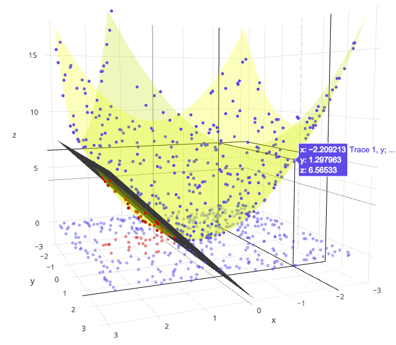
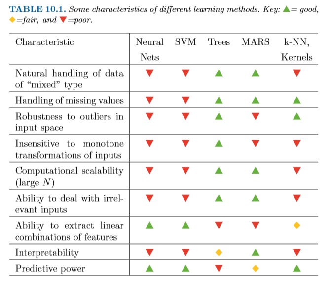
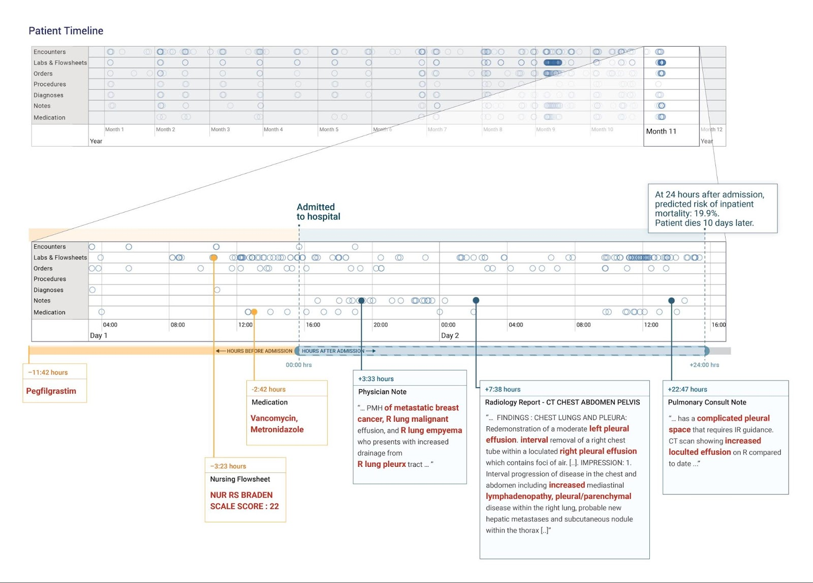
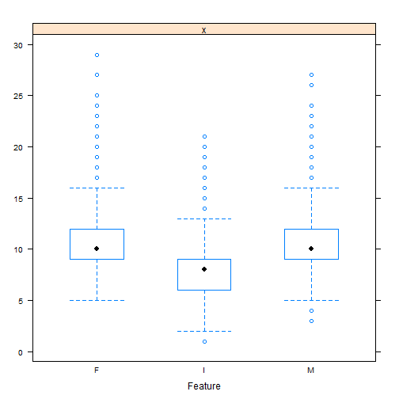
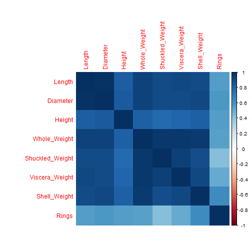
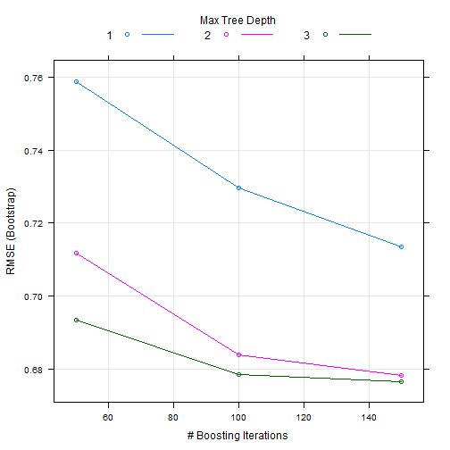
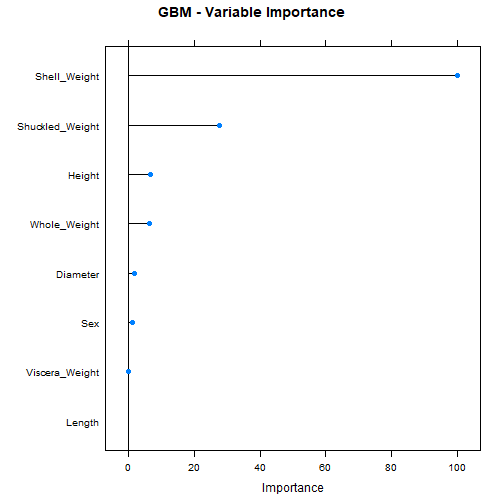
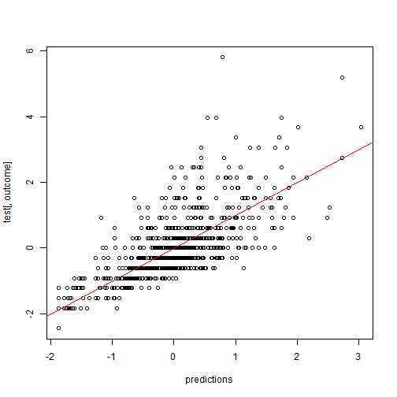

<!-- Limit image width and height -->
<style type='text/css'>
img {
    max-height: 560px;
    max-width: 964px;
}
</style>

<!-- Center image on slide -->
<script src="http://ajax.aspnetcdn.com/ajax/jQuery/jquery-1.7.min.js"></script>
<script type='text/javascript'>
$(function() {
    $("p:has(img)").addClass('centered');
});
</script>

## Machine learning

" A method of data analysis that automates analytical model building. It is a branch of artificial intelligence based on the idea that systems can learn from data, identify patterns and make decisions with minimal human intervention. "


> - coined by Arthur Samuel in 1959
> - closely related to computational statistics
> - focuses on making predictions / classifications
> - supervised or unsupervised learning
> - Goals: produce reliable and repeatable decisions, uncover hidden patterns/insights within subjects of interest

---

## Types of Machine learning

Supervised
> - Linear regression
> - Decision trees
> - Support vector machines
> - Neural networks

Unsupervised
> - Clustering 
    Hierarchical clustering
    Mixture models
> - Neural Networks
    Self-organizing map
    Generative Adversarial Networks
> - Late variable models
    Expectation-maximization
> - Blind signal separation
    Principal component analysis
    Singular value decomposition

---

## Models in Caret


```r
library(caret)
names(getModelInfo())
```


---

## Decision trees


---

## Support vector machines



---

## Neural networks


---

## Which model to choose?


### Source: ESL (Hastie)

---

## Google AI: Deep Learning for Electronic Health Records

"When patients get admitted to a hospital, they have many questions about what will happen next. When will I be able to go home? Will I get better? Will I have to come back to the hospital? Having precise answers to those questions helps doctors and nurses make care better, safer, and faster - if a patient's health is deteriorating, doctors could be sent proactively to act before things get worse."

---



--- bg:pink

## Caret package in R

Classification And Regression Training  
A wrapper package that contains a set of functions to streamline creation of predictive models  
Includes tools for data splitting, pre-processing, feature selection, model tuning, etc. 


---

## Steps
> 1. Getting started
> 2. Training/testing split
> 3. Pre-processing
> 4. Feature selection
> 5. Train models
> 6. Parameter tuning
> 7. Variable importance estimation
> 8. Model performance

--- bg:yellow

## Demonstration

For this demo, we will use the Abalone dataset from an original study on Abalone population in Australia.  

"The Population Biology of Abalone (_Haliotis_ species) in Tasmania. I. Blacklip Abalone (_H. rubra_) from the North Coast and Islands of Bass Strait"
Nash (1994)

---

## 1. Getting started

Sex / nominal / -- / M, F, and I (infant)  
Length / continuous / mm / Longest shell measurement  
Diameter	/ continuous / mm / perpendicular to length  
Height / continuous / mm / with meat in shell  
Whole weight / continuous / grams / whole abalone  
Shucked weight / continuous	/ grams / weight of meat  
Viscera weight / continuous / grams / gut weight (after bleeding)   
Shell weight / continuous / grams / after being dried  
Rings / integer / -- / +1.5 gives the age in years  


```r
library(caret)
```


```r
data = read.csv("abalone.data", header = F)
colnames(data) = c("Sex", "Length", "Diameter", "Height", "Whole_Weight", 
                   "Shuckled_Weight", "Viscera_Weight", "Shell_Weight", "Rings")
```

---


```r
dim(data)
```

```
## [1] 4177    9
```

```r
sum(is.na(data))
```

```
## [1] 0
```

---


```r
summary(data)
```

```
##  Sex          Length         Diameter          Height      
##  F:1307   Min.   :0.075   Min.   :0.0550   Min.   :0.0000  
##  I:1342   1st Qu.:0.450   1st Qu.:0.3500   1st Qu.:0.1150  
##  M:1528   Median :0.545   Median :0.4250   Median :0.1400  
##           Mean   :0.524   Mean   :0.4079   Mean   :0.1395  
##           3rd Qu.:0.615   3rd Qu.:0.4800   3rd Qu.:0.1650  
##           Max.   :0.815   Max.   :0.6500   Max.   :1.1300  
##   Whole_Weight    Shuckled_Weight  Viscera_Weight    Shell_Weight   
##  Min.   :0.0020   Min.   :0.0010   Min.   :0.0005   Min.   :0.0015  
##  1st Qu.:0.4415   1st Qu.:0.1860   1st Qu.:0.0935   1st Qu.:0.1300  
##  Median :0.7995   Median :0.3360   Median :0.1710   Median :0.2340  
##  Mean   :0.8287   Mean   :0.3594   Mean   :0.1806   Mean   :0.2388  
##  3rd Qu.:1.1530   3rd Qu.:0.5020   3rd Qu.:0.2530   3rd Qu.:0.3290  
##  Max.   :2.8255   Max.   :1.4880   Max.   :0.7600   Max.   :1.0050  
##      Rings       
##  Min.   : 1.000  
##  1st Qu.: 8.000  
##  Median : 9.000  
##  Mean   : 9.934  
##  3rd Qu.:11.000  
##  Max.   :29.000
```

---


```r
featurePlot(x = data[, 2:8],
            y = data$Rings,
            plot = "scatter")
```


---


```r
featurePlot(x = data$Rings, 
            y = data$Sex, 
            plot = "box")
```



---


```r
library(corrplot)
```


```r
M = cor(data[,-1])
corrplot(M, method = "color")
```



---

## 2. Training/testing split

Splitting into 80% training set and 20% testing set.

- Splitting based on predictors
- Splitting based on outcome

```r
intrain = createDataPartition(data$Rings, p=0.8, list=FALSE)
train = data[ intrain,]
test = data[-intrain,]
```

---

## 3. Pre-processing

- Create dummy variables
- Zero- and Near Zero-variance analysis
- Correlated predictors
- Linear Dependencies
- Imputation
- Center and Scale

```r
preProcValues = preProcess(train, method = c("knnImpute")) #automatically centers and scales
train = predict(preProcValues, train)
preProcValues = preProcess(test, method = c("knnImpute"))
test = predict(preProcValues, test)
```

---


```r
summary(train)
```

```
##  Sex          Length           Diameter           Height        
##  F:1042   Min.   :-3.4331   Min.   :-3.1972   Min.   :-3.30641  
##  I:1060   1st Qu.:-0.6197   1st Qu.:-0.5873   1st Qu.:-0.58397  
##  M:1241   Median : 0.1664   Median : 0.1656   Median : 0.00786  
##           Mean   : 0.0000   Mean   : 0.0000   Mean   : 0.00000  
##           3rd Qu.: 0.7456   3rd Qu.: 0.7177   3rd Qu.: 0.59969  
##           Max.   : 2.4005   Max.   : 2.4242   Max.   :23.44452  
##   Whole_Weight      Shuckled_Weight    Viscera_Weight    
##  Min.   :-1.67135   Min.   :-1.60985   Min.   :-1.64116  
##  1st Qu.:-0.79104   1st Qu.:-0.77745   1st Qu.:-0.80064  
##  Median :-0.06141   Median :-0.09985   Median :-0.09117  
##  Mean   : 0.00000   Mean   : 0.00000   Mean   : 0.00000  
##  3rd Qu.: 0.65103   3rd Qu.: 0.63046   3rd Qu.: 0.64994  
##  Max.   : 4.02715   Max.   : 5.05612   Max.   : 5.22311  
##   Shell_Weight          Rings        
##  Min.   :-1.68536   Min.   :-2.4610  
##  1st Qu.:-0.78327   1st Qu.:-0.5984  
##  Median :-0.03745   Median :-0.2880  
##  Mean   : 0.00000   Mean   : 0.0000  
##  3rd Qu.: 0.63734   3rd Qu.: 0.3329  
##  Max.   : 5.43189   Max.   : 5.9206
```

---


```r
summary(test)
```

```
##  Sex         Length           Diameter           Height        
##  F:265   Min.   :-3.8066   Min.   :-3.5854   Min.   :-3.21135  
##  I:282   1st Qu.:-0.6015   1st Qu.:-0.6179   1st Qu.:-0.59561  
##  M:287   Median : 0.1250   Median : 0.1495   Median : 0.02718  
##          Mean   : 0.0000   Mean   : 0.0000   Mean   : 0.00000  
##          3rd Qu.: 0.8088   3rd Qu.: 0.7634   3rd Qu.: 0.64998  
##          Max.   : 2.0908   Max.   : 1.9914   Max.   : 9.36910  
##   Whole_Weight      Shuckled_Weight   Viscera_Weight     Shell_Weight     
##  Min.   :-1.69852   Min.   :-1.6067   Min.   :-1.6545   Min.   :-1.74629  
##  1st Qu.:-0.78955   1st Qu.:-0.8046   1st Qu.:-0.7981   1st Qu.:-0.81489  
##  Median :-0.06643   Median :-0.1308   Median :-0.1198   Median :-0.06072  
##  Mean   : 0.00000   Mean   : 0.0000   Mean   : 0.0000   Mean   : 0.00000  
##  3rd Qu.: 0.70763   3rd Qu.: 0.6913   3rd Qu.: 0.6915   3rd Qu.: 0.69251  
##  Max.   : 3.69355   Max.   : 4.5762   Max.   : 3.1777   Max.   : 3.25763  
##      Rings        
##  Min.   :-2.7672  
##  1st Qu.:-0.6048  
##  Median :-0.2959  
##  Mean   : 0.0000  
##  3rd Qu.: 0.3219  
##  Max.   : 4.0287
```

---

## 4. Feature selection

Many models have built-in feature selection methods, often based on error minimization / likelihood maximization. For models without this intrinsic method, feature selection can be performed via a variety of approaches in caret. 

```r
control <- rfeControl(functions = rfFuncs,
                   method = "repeatedcv",
                   repeats = 3,
                   verbose = F)
outcome = 'Rings'
predictors = names(train)[!names(train) %in% outcome]
rfe(train[,predictors], train[,outcome],
                      rfeControl = control)

predictors = c("Shuckled_Weight", "Shell_Weight", "Sex", "Height", "Viscera_Weight")
```


---

## 5. Train models


```r
#set seed
set.seed(123)

#Gradient boosting
model_gbm<-train(train[,predictors],train[,outcome],method='gbm')

#Random forest
model_rf<-train(train[,predictors],train[,outcome],method='rf')

#Support vector machine
model_glm<-train(train[,predictors],train[,outcome],method='svmLinear')

#Neural networks
model_nnet<-train(train[,predictors],train[,outcome],method='nnet')#feed-forward, single hidden-layer network
```

---

## 6. Parameter tuning

Tuning can be performed via the specification of a tuning grid or tuning length.

```r
fitControl <- trainControl(
  method = "repeatedcv",
  number = 5,
  repeats = 5)

modelLookup(model='gbm')
```

```
##   model         parameter                   label forReg forClass
## 1   gbm           n.trees   # Boosting Iterations   TRUE     TRUE
## 2   gbm interaction.depth          Max Tree Depth   TRUE     TRUE
## 3   gbm         shrinkage               Shrinkage   TRUE     TRUE
## 4   gbm    n.minobsinnode Min. Terminal Node Size   TRUE     TRUE
##   probModel
## 1      TRUE
## 2      TRUE
## 3      TRUE
## 4      TRUE
```

---


```r
#Creating grid
grid <- expand.grid(n.trees=c(10,20,50,100,500,1000),
                    shrinkage=c(0.01,0.05,0.1,0.5),
                    n.minobsinnode = c(3,5,10),
                    interaction.depth=c(1,5,10))

# training the model
#using tune grid
model_gbm<-train(train[,predictors],train[,outcome],
                 method='gbm',trControl=fitControl,tuneGrid=grid)
#using tune length
model_gbm<-train(train[,predictors],train[,outcome],
                 method='gbm',trControl=fitControl,tuneLength=10)
```

---


```r
print(model_gbm)
```

```
## Stochastic Gradient Boosting 
## 
## 3343 samples
##    8 predictor
## 
## No pre-processing
## Resampling: Bootstrapped (25 reps) 
## Summary of sample sizes: 3343, 3343, 3343, 3343, 3343, 3343, ... 
## Resampling results across tuning parameters:
## 
##   interaction.depth  n.trees  RMSE       Rsquared   MAE      
##   1                   50      0.7502591  0.4454662  0.5382197
##   1                  100      0.7206563  0.4865738  0.5157580
##   1                  150      0.7043399  0.5073519  0.5044893
##   2                   50      0.7000025  0.5158610  0.4998578
##   2                  100      0.6750586  0.5438537  0.4782080
##   2                  150      0.6711010  0.5483069  0.4737402
##   3                   50      0.6843659  0.5340065  0.4852911
##   3                  100      0.6711283  0.5482569  0.4732381
##   3                  150      0.6706128  0.5490469  0.4723335
## 
## Tuning parameter 'shrinkage' was held constant at a value of 0.1
## 
## Tuning parameter 'n.minobsinnode' was held constant at a value of 10
## RMSE was used to select the optimal model using the smallest value.
## The final values used for the model were n.trees = 150,
##  interaction.depth = 3, shrinkage = 0.1 and n.minobsinnode = 10.
```

---


```r
plot(model_gbm)
```



---

## 7. Variable importance estimation


```r
#Variable Importance
library(gbm)
```

```
## Loaded gbm 2.1.4
```

```r
varImp(object=model_gbm)
```

```
## gbm variable importance
## 
##                 Overall
## Shell_Weight    100.000
## Shuckled_Weight  28.940
## Height            8.365
## Whole_Weight      3.968
## Diameter          2.822
## Sex               1.661
## Viscera_Weight    1.609
## Length            0.000
```

---


```r
#Plotting Varianble importance for GBM
plot(varImp(object=model_gbm),main="GBM - Variable Importance")
```



---

## 8. Model performance

Classification: ROC, Accuracy, Sensitivity, Specificity (confusion matrix)  
Regression: RMSE, R-squared, MAE

```r
#Predictions
predictions<-predict.train(object=model_gbm,test[,predictors],type="raw")

#Performance
#Measures for regression
postResample(pred = predictions, obs = test[,outcome])

#Measures for classification
confusionMatrix(predictions,test[,outcome])
```


```
##      RMSE  Rsquared       MAE 
## 0.7063146 0.5029404 0.5014429
```

---


```r
plot(predictions, test[,outcome])
abline(a = 0 , b = 1, col = "red")
```



---

## References and Resources

- Caret user guide: http://topepo.github.io
- Caret tutorial: https://datascienceplus.com/machine-learning-with-r-caret-part-1/
- Coursera: https://www.coursera.org/lecture/practical-machine-learning/caret-package-Bu9ns
- Google AI for EHR Example: https://ai.googleblog.com/2018/05/deep-learning-for-electronic-health.html
- Machine learning in Python: https://www.kaggle.com/ragnisah/eda-abalone-age-prediction
- Mathematical concepts: Introduction to Statistical Learning (Gareth James), Elements of Statistical Learning (Trevor Hastie)
